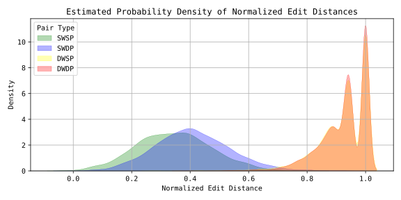
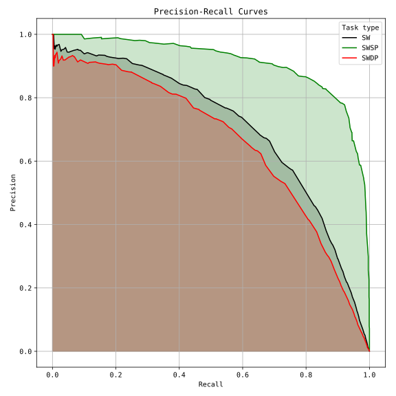

# `samediffed`: same-different evaluation with edit distance



This repo contains a library to evaluate how well **discrete speech features** are able to discriminate between words using only **normalized edit distance**.

The task is to predict whether two instances of spoken words are the same word or not.

The same-different evaluation was proposed by Carlin et. al. in [Rapid Evaluation of Speech Representations for Spoken Term Discovery](https://www.isca-archive.org/interspeech_2011/carlin11_interspeech.pdf). They, instead, evaluated continuous features using dynamic time-warping.

## Installation

1. You will need [Cargo](https://doc.rust-lang.org/cargo/getting-started/installation.html), which includes a Rust compiler, on your system. This installation is minimal and won't bloat your system. You can install Cargo with:

    ```sh
    curl https://sh.rustup.rs -sSf | sh
    ```

2. Using a python environment, clone this repo and pip install

    ```sh
    git clone https://github.com/nicolvisser/samediffed.git
    cd samediffed
    pip install -e .
    ```

## Data preparation

### 1. The `.item` file

You should have a `.item` file containing the word boundaries.

    #file onset offset #word speaker
    84-121123-0001 2.86 3.46 extraordinary 84
    84-121123-0003 4.65 5.39 frightful 84
    84-121123-0003 5.81 6.5 silence 84
    ...

This `.item` file is a space-separated file with the following columns:

|column |type   |description                  |
|-------|-------|-----------------------------|
|#file  |`str`  |filename without extension   |
|onset  |`float`|start time of word in seconds|
|offset |`float`|end time of word in seconds  |
|#word  |`str`  |the word label               |
|speaker|`int`  |an ID, unique to each speaker|

If you already have a directory with the alignments as `.TextGrid` files, then you can use use the `make_samediff_item_file` function to generate the .item file for you:

```py
from samediffed import make_samediff_item_file

make_samediff_item_file(
    textgrid_dir="path/to/TextGrid/directory/",
    item_file_path="desired/path/to/samediff.item",
    tier_name="words",
    min_chars=5,
    min_dur=0.5,
    min_count=2,
)
```

The last 3 arguments are set by default to the values from the [same-different paper](https://www.isca-archive.org/interspeech_2011/carlin11_interspeech.pdf). We don't want to include words that are too short.

You can find `.item` files for LibriSpeech in the `data/` directory.

### 2. The units directory

The tool expects as input a 1-dimensional numpy array of long values for each utterance. The values should be repeated at some regular frequency such as 50 Hz. E.g. `[6, 6, 4, 4, 1, 1, 7, 7, 7, 6]`. The tool will then snip out the segment coresponding to the word `[4, 4, 1, 1, 7, 7]` and deduplicate the sequence `[4, 1, 7]`.

Ideally the units directory should contain `.npy` files with the same filenames as in the `.item` file.
But you can also define a `units_maker` helper function that will be passed to the tool. See [Non-standard units directory](#2-non-standard-units-directory).


## Usage

### 1. Basic usage

The tool splits the evaluation in 3 steps:
- setup
- run
- evaluate

This way you can inspect intermediate results if needed.

```py
from samediffed import (
    setup_tasks,
    run_tasks,
    evaluate_results,
)

# load data and prepare tasks
task_df = setup_tasks(
    item_file_path="path/to/item/file.item",
    units_dir="path/to/units/directory/",
    frequency=50,
)

# compute pairwise edit distances
results = run_tasks(task_df)

# compute evaluation metrics
evaluated_results = evaluate_results(results)

# print and save results
print(f"AP SW: {evaluated_results.sw.average_precision}")
evaluated_results.save_json("results.json")
```

Notes:
- `task_df` is a `polars.DataFrame` with all the data needed to run the evaluation.
- `results` is a custom dataclass `Results` containing the computed edit distances in `polars.DataFrame`s.
    - You can access the data frames that contain the four task condtions with:
        - `results.swsp` ($C_1$ in [paper](https://www.isca-archive.org/interspeech_2011/carlin11_interspeech.pdf))
        - `results.swdp` ($C_2$ in [paper](https://www.isca-archive.org/interspeech_2011/carlin11_interspeech.pdf))
        - `results.dwsp` ($C_3$ in [paper](https://www.isca-archive.org/interspeech_2011/carlin11_interspeech.pdf))
        - `results.dwdp` ($C_4$ in [paper](https://www.isca-archive.org/interspeech_2011/carlin11_interspeech.pdf))
- `evaluated_results` is a custom dataclass `EvaluatedResults` to easily access results for the three tasks:
    - The three tasks are
        - `sw` (any speaker)
        - `swsp` (same speaker)
        - `swdp` (different speakers)
    - The metrics for each task are:
        - `precision`: `np.ndarray`
        - `recall`: `np.ndarray`
        - `thresholds`: `np.ndarray`
        - `average_precision`: `float`
        - `precision_recall_breakeven`: `float`
    - You can access a metric like this:
        - `evaluated_results.sw.average_precision`
    - The `save_json` method will dump the results in the following format:
        ```json
        {
            "AP SW": 0.708197325303691,
            "AP SWSP": 0.910897010391853,
            "AP SWDP": 0.6592721365518044,
            "PRB SW": 0.6718664477285167,
            "PRB SWSP": 0.41911466089075405,
            "PRB SWDP": 0.673744102137108
        }
        ```

I suggest that you run an evaluation in a Jupyter notebook and then just print out the various variables. This should give a better idea of how and where the results are saved.

### 2. Non-standard units directory

If your units are not saved in numpy Long arrays, you can define a `units_maker` to convert your data on the fly.

Example of such a use case:

- Your units are stored as 1D `torch.uint8` tensors in `.pt` files.

    You will then pass the extension `".pt"` to the `setup_tasks` function such that the tool can find paths to the tensors instead of the numpy arrays.
    
    You will also define and pass a `units_maker` function to load and convert the tensors to numpy.

    ```py
    import torch
    import numpy as np
    from pathlib import Path

    def units_maker(path: Path):
        return torch.load(path).long().numpy()
    ```

    Now, when calling `setup_tasks` pass the extension and this maker function.

    ```py
    ...
    task_df = setup_tasks(
        ...
        extension=".pt",
        units_maker=units_maker,
    )
    ...
    ```

### 2. Optional extras

Here is some optional stuff you can do to visualize the results

```py
from samediffed import (
    plot_density,
    plot_precision_vs_recall,
    show_interactive_examples,
):
    # plot the density of the normalized edit distances
    fig_density = plot_density(results)
    fig_density.savefig("density.svg", format="svg")

    # plot the precision vs recall curve
    fig_pr = plot_precision_vs_recall(evaluated_results)
    fig_pr.savefig("precision-recall.svg", format="svg")

    # show examples where you can listen to the snippets
    # you need to do this in a Jupyter or interactive environment!
    show_interactive_examples(
        task_df,
        results,
        waveforms_dir="/mnt/wsl/newt/datasets/LibriSpeech/dev-clean",
        waveform_extension=".flac",
        num_samples=1,
        seed=42,
    )
```

- density.svg
    
- precision-recall.svg
    
